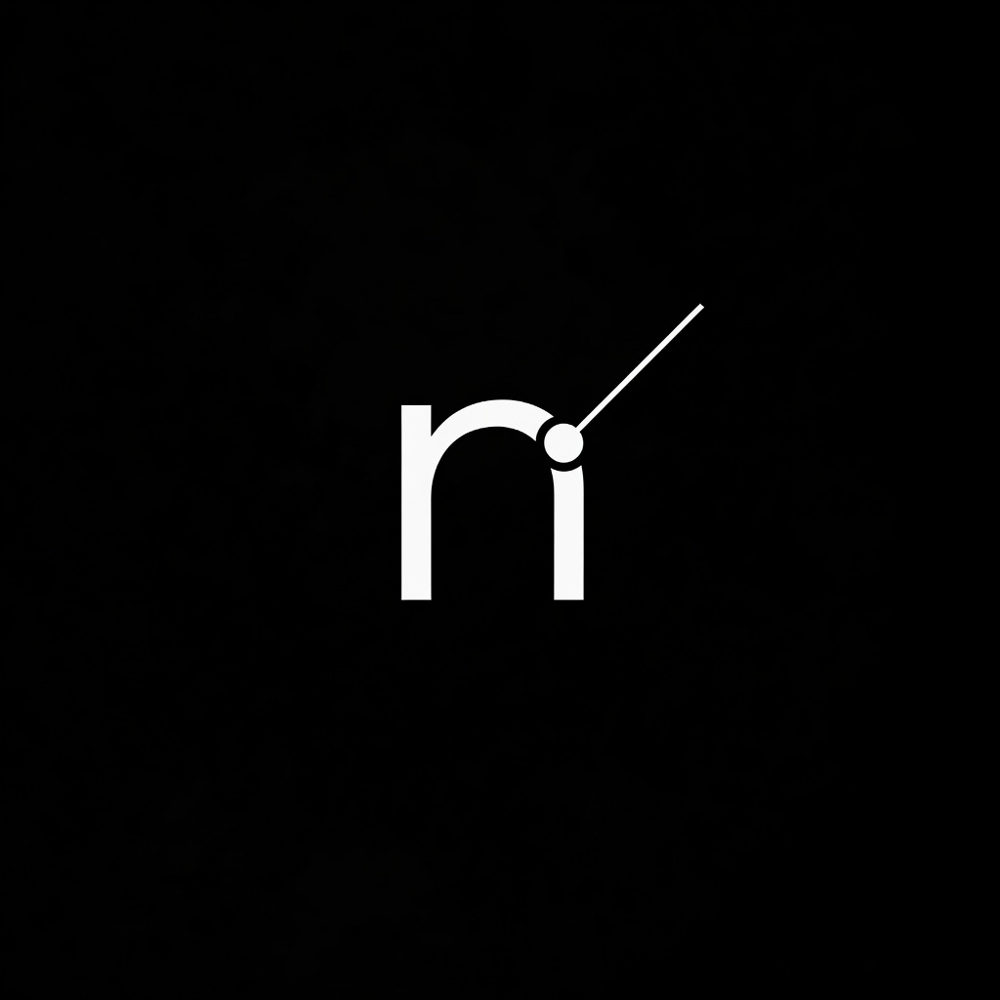
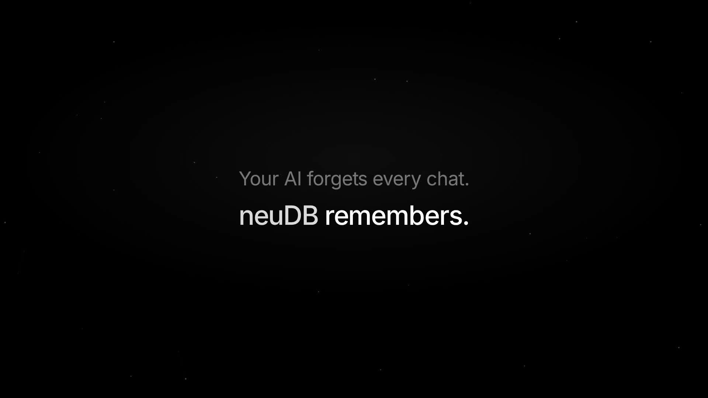

<p align="center">
  
</p>

<h1 align="center">neuDB</h1>

<p align="center">
  <strong>AI-native database for everything you remember.</strong><br>
  Zero dependencies · Human-readable JSON · Semantic search built in
</p>

<p align="center">
  <a href="docs/launch-video/neudb-launch-15s.mp4">
    
  </a>
</p>

<p align="center">
  <a href="https://pypi.org/project/neudb/"></a>
  <a href="LICENSE"></a>
  <a href="https://www.python.org/"></a>
  <a href="https://github.com/neuralbroker/neudb/actions"></a>
</p>

<p align="center">
  <a href="docs/launch-video/neudb-launch-15s.mp4">Launch video</a> ·
  <a href="#quick-start">Quick start</a> ·
  <a href="#features">Features</a> ·
  <a href="#ai-memory">AI memory</a> ·
  <a href="#http-api">API</a> ·
  <a href="#agent">Agent</a> ·
  <a href="CHANGELOG.md">Changelog</a>
</p>

---

## Features

| | |
|---|---|
| **No server, no config** | A folder of JSON tables — `cat` is your debugger |
| **Semantic search** | Cosine similarity on embeddings, pure Python |
| **Text fallback** | Case-insensitive search when embeddings are off |
| **AI memory schema** | Users, sessions, messages, tags, memories |
| **Three interfaces** | Python library, CLI, optional HTTP API + agent |

## Quick start

```bash
git clone https://github.com/neuralbroker/neudb.git
cd neudb
pip install -e .
```

**CLI**

```bash
neudb table create users
neudb row insert users --data '{"username":"alice"}'
neudb row list users
```

**Library**

```python
from neudb import connect

db = connect("mydb")
users = db.table("users")
users.insert({"username": "bob"})
users.search_text("username", "bo")
```

## Install extras

```bash
pip install neudb              # core only
pip install "neudb[api]"       # FastAPI HTTP server
pip install "neudb[agent]"     # LLM memory agent + embeddings
pip install "neudb[test]"      # pytest + httpx
pip install -e ".[api,agent,test]"   # development
```

## AI memory

```python
from neudb.ai_schema import *

db = init_ai_database("my_memory")
alice = add_user(db, "alice", "alice@example.com")
session = create_session(db, alice, "Chat about Python")
add_message_with_embedding(db, session, "user", "How do I fix an import error?")

# Search by meaning
vec = embed_text("Python import errors")
results = db.table("messages").search_similar("embedding", vec, top_k=5)
```

## HTTP API

```bash
pip install -e ".[api]"
export NEUDB_API_KEY="change-me"
uvicorn neudb.api:app --reload
```

Swagger UI: http://127.0.0.1:8000/docs

```bash
curl -X POST http://127.0.0.1:8000/users \
  -H 'Content-Type: application/json' \
  -H 'X-API-Key: change-me' \
  -d '{"username":"alice","email":"alice@example.com"}'
```

| Variable | Default | Purpose |
|----------|---------|---------|
| `NEUDB_API_KEY` | *(required)* | Auth for all DB endpoints |
| `NEUDB_API_DB` | `neudb_api_data/` | API storage directory |

## Agent

Long-term memory loop for Ollama or OpenAI:

```bash
ollama pull llama3.2
pip install -e ".[agent]"
neudb-agent --provider ollama --model llama3.2
```

```bash
export OPENAI_API_KEY="..."
neudb-agent --provider openai --model gpt-4o-mini
```

Each turn: search similar messages → inject context → save the exchange.

## Demos

```bash
python demos/realworld_coding_assistant.py  # full walkthrough (recommended)
python demos/agent_demo.py                  # users, sessions, tags, memories
python demos/semantic_demo.py               # cosine similarity (2D vectors)
python demos/real_semantic_demo.py          # real embeddings
```

## Project structure

```
neudb/
├── neudb/              # Python package
│   ├── __init__.py     # Core engine (Table, Database, CLI)
│   ├── ai_schema.py    # AI memory helpers
│   ├── api.py          # FastAPI HTTP API
│   └── agent.py        # LLM memory agent
├── tests/              # pytest suite (24 tests)
├── demos/              # Example scripts
├── docs/
├── website/            # Product landing page (local)
├── pyproject.toml
└── CHANGELOG.md
```

## Development

```bash
pip install -e ".[test,api]"
pytest
flake8 neudb/ tests/ --max-line-length=120 --ignore=E402,W503
```

## License

MIT — see [LICENSE](LICENSE).

## Changelog

See [CHANGELOG.md](CHANGELOG.md).